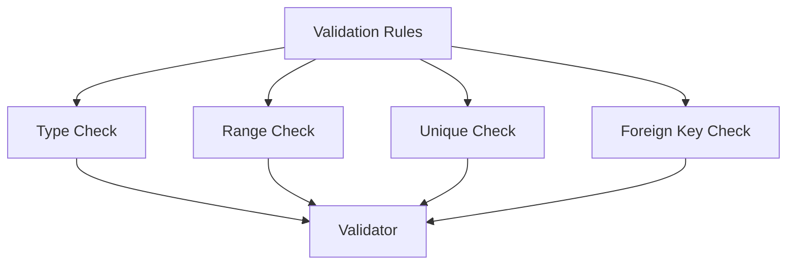
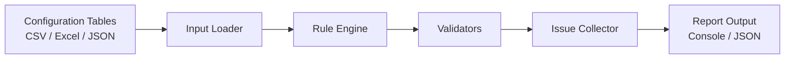

# Game Config Validator

[](https://github.com/xdnyb/game-config-validator/actions)


A lightweight demo framework for validating game configuration tables.

This project demonstrates how to automatically detect common configuration errors in game static data tables such as:

- field type mismatch
- invalid numeric range
- duplicate primary keys
- broken foreign key references

The framework is designed with a simple layered architecture and supports rule-based validation driven by JSON configuration.

## 1. Project Background

In game development, static configuration tables (such as Excel, CSV, JSON, XML) are the foundation of gameplay logic. However, table errors are common, including:

- field type mismatch
- invalid numeric range
- duplicate primary keys
- broken foreign key references
- business logic conflicts

Traditionally, these problems are found during manual checking or functional testing, which leads to high debugging cost and delayed feedback.  
This project aims to build a small automated validation framework that detects table issues earlier in the development workflow.

## 2. Design Goals

The framework is designed to:

- load different configuration tables
- validate them with configurable rules
- report errors precisely
- support future integration with CI/CD workflow

## 3. Architecture Design

### Rule System



### Architecture Overview



The framework is organized into four layers:

### 3.1 Input Layer
Responsible for loading table files and converting them into a unified internal structure.

Current demo supports:
- CSV

Future extension:
- Excel
- JSON
- XML

### 3.2 Rule Layer
Responsible for defining validation rules.

Current rule categories:
- type check
- range check
- unique check
- foreign key check

Rules are defined in `rules/rules.json`, instead of being hardcoded in the main logic.

### 3.3 Validation Layer
Responsible for executing validators according to rule type.

Current validators:
- `check_type`
- `check_range`
- `check_unique`
- `check_foreign_key`

### 3.4 Output Layer
Responsible for reporting issues.

Current output:
- console log
- JSON report (`output/report.json`)

Each issue includes:
- table name
- row number
- field name
- rule type
- error message

## 4. Rule Abstraction

The framework abstracts validation rules into structured JSON configuration.

Example:

```json
{
  "type": "range",
  "field": "price",
  "min": 0,
  "max": 999999
}
```

This approach improves maintainability and allows quick adaptation to different table schemas.

In a more complete version, rules can be divided into:

- single-table rules
- multi-table relation rules
- custom business logic rules

## 5. Performance and Scalability

For large-scale configuration data, the following optimizations can be applied:

- use hash set / dict for unique and foreign key checks
- run validation in parallel by table
- support incremental checking in CI
- support streaming/chunk reading for large files

For project adaptation, the framework can reuse the same validation engine while changing only:

- loaders
- schema definitions
- rule configuration

## 6. CI/CD Integration

This framework can be integrated into the development workflow in multiple stages:

- local pre-commit validation
- pull request / merge request CI validation
- full validation before release

When validation fails, the framework can output precise issue location:

- table
- row
- field
- error type

In a real project, it can be further connected with:

- Git commit author
- table owner mapping
- Feishu / email notifications

In this demo, GitHub Actions is used as a lightweight CI example.  
Whenever code is pushed to the repository, the workflow automatically runs `python main.py` to validate the configuration tables.  
If validation issues are found, the workflow fails, simulating an automated quality gate in the development pipeline.

## 7. Demo Scope

This demo currently supports:

- CSV input
- JSON-based rule configuration
- field type validation
- numeric range validation
- unique key validation
- foreign key validation

Although lightweight, it demonstrates the core workflow of:
**input → rule parsing → validation → reporting**

## 8. Project Structure

```bash
game-config-validator/
├── core/
│   ├── issue.py
│   ├── loader.py
│   ├── validators.py
│   └── engine.py
├── data/
│   ├── item.csv
│   └── reward.csv
├── rules/
│   └── rules.json
├── output/
│   └── report.json
├── main.py
├── README.md
└── .gitignore
```


## 9. How to Run

```
python main.py
```

## 10. Example Output

### Demo Dataset

Two datasets are provided:

- `data/item.csv` – contains intentional errors for demonstration
- `data/item_valid.csv` – valid dataset used in CI workflow

```
Check failed. Issues:
[range_check] item.csv row=3 field=price: value -5 < min 0
[range_check] item.csv row=5 field=price: value 'abc' is not a valid int
[unique_check] item.csv row=4 field=id: duplicate value '2', first seen at row 3
[foreign_key_check] item.csv row=3 field=reward_id: value '999' not found in reward.csv.id
```

## 11. Future Improvements

Possible next steps:

- support Excel / JSON / XML
- support schema definition files
- support custom business-rule plugins
- support HTML report
- integrate with GitHub Actions / Jenkins
- support responsibility mapping and notification
